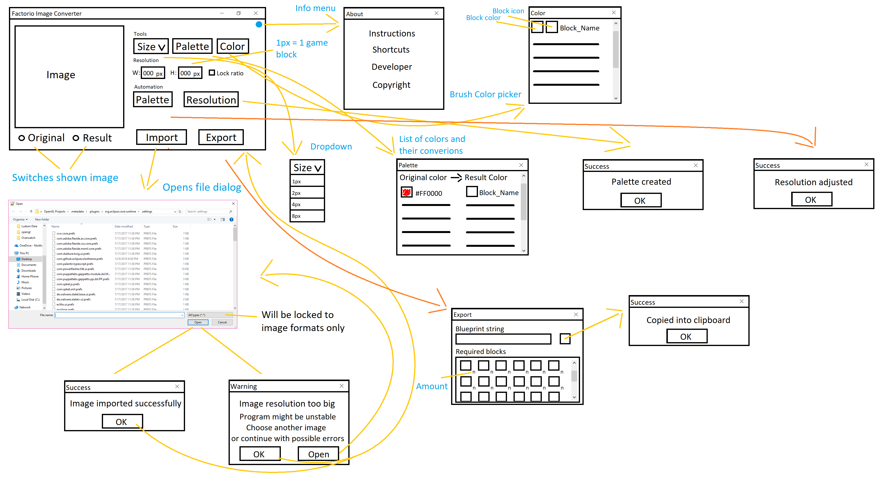

# Factorio Image Converter

Jan Frídl  
janfridl@seznam.cz  
6. 6. 2021  
Verze 1.0

* Úvod
  * Účel dokumentu
    * Upřesnění specifikací a funkčnosti programu
  * Pro koho je dokument určený
    * Převážně pro vývojáře a také pro jakékoliv zájemce o program
  * Kontakty
    * Jan Frídl - janfridl@seznam.cz
  * Odkazy na ostatní dokumenty
    * https://wiki.factorio.com/Blueprint_string_format
    * https://github.com/ZapperCZ/WPF-Factorio_Image_Converter/edit/main/README-CZ.md
* Scénáře
  * Způsoby využití
    * Převedení obrázku do hry Factorio
    * Upravení obrázku
    * Zjištění počtu materiálu na obrázek
    * Vytvoření obrázku do hry Factorio
  * Uživatelské role
    * Základní uživatel
    * Pokročilý uživatel
  * Vymezení rozsahu
    * Program nedokáže automaticky vytvořit kvalitní "pixel art" z normálního obrázku
  * Výkonnost
    * Program nebude ideální pro vytváření obrázku
    * Program nebude optimalizovaný na práci s velkými obrázky 
* Celková hrubá architektura
  * Pracovní tok
    1. Uživatel si vybere obrázek pro import
        * Uživatel kliknutím na tlačítko Import otevře prohlížeč souborů
        * V prohlížeči si uživatel vybere obrázek, pokud je jeho rozlišení příliš velké, bude upozorněn
        * V případě velkého rozlišení může uživatel pokračovat s možností nestability programu, a nebo vybrat menší obrázek
    2. Uživatel upraví obrázek
        * Po nahrání obrázku ho uživatel může upravit
        * K dispozici má automatický výběr finální palety a rozlišení, štětec s nastavitelnou velikostí a barvou a manuální úpravu finální palety a rozlišení
        * Uživatel také může přepínat mezi zobrazeným obrázkem a porovnávat původní obrázek s výsledným
        * Základní uživatel bude převážně používat automatických úprav a možná trochu manuální korekce
        * Pokročilý uživatel může využít poskytnutých manuálních nástrojů k velkým úpravám obrázku a dosažení ideálního výsledku
    3. Uživatel exportuje obrázek
        * Když je uživatel hotov s úpravou, může exportovat svůj výtvor
        * Po stisknutí tlačítka se otevře dialog, ve kterém si uživatel může zkopírovat výsledný string, který nahraje do hry
        * V dialogu se také dozví, kolik ho jeho výtvor bude stát ve hře materiálů.
        * Pokud se mu nelíbí cena, může zrušit export a za pomocí palety vyměnit některé bloky a poté znovu exportovat
  * GUI
    
    
  * Detaily
    * U veškerých tlačítek, které uživatel zmáčkne je dána zpětná vazba o tom, co se stalo.
    * Základní uživatel může využít informačního dialogu na hlavním okně který se otevře stisknutím tlačítka v pravém horním rohu. V tomto dialogu najde instrukce k používání programu a také užitečné zkratky pro urychlení úpravy obrázku
    * Maximální rozlišení herního obrázku bude omezeno na 999x999 z důvodu výkonnosti a také ceny materiálu
    * Formulář bude plně responzivní a bude se přízpůsobovat poměru vloženého obrázku
